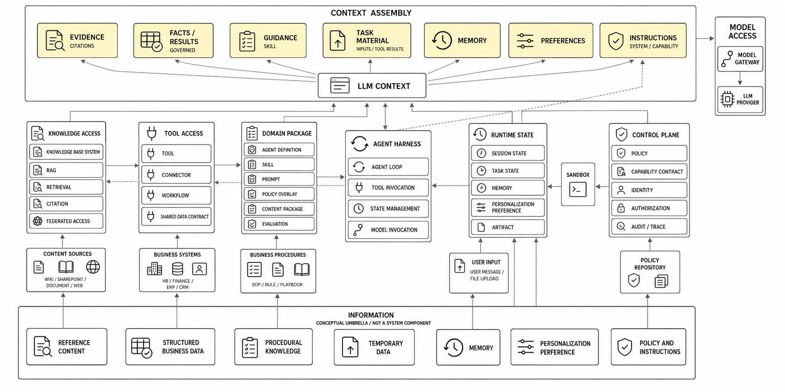

# Information, Knowledge Base System, and Context

## 目的

本文不把广义的 `Knowledge` 建模为平台需要拥有的系统实体。企业中的信息来自很多系统和主体；平台需要做的是，在一次 `Agentic Task` 中，以可审计的方式找到、验证、排序并组装需要进入 `LLM Context` 的材料。

行业中的 `Context Engineering` 也采用类似的方向：每次 model inference 都从持续变化的信息集合中选择最有用的一组 tokens。候选信息不仅来自 `Prompt`，也可能来自 external data、message history、tool result、`Memory` 和 runtime state。

## 概念图



## 术语层级

| Term | 在本体系中的含义 | 是否是平台实体 |
| --- | --- | --- |
| `Information` | 所有可能对 `Agentic Task` 有用的事实、内容、规则、状态和偏好，是上位描述。 | 否 |
| `Data` | 可以被记录、读取、传输或计算的事实和内容，既可以是 structured，也可以是 unstructured。 | 取决于具体 subtype |
| `Structured Business Data` | 来自 HR、Finance、Insurance 等 system of record 的结构化业务事实和计算输入。 | 由外部 system 或 `Data Service` 持有 |
| `Knowledge Base Content` | 由 `Knowledge Base System` 接入、索引或 federation 的非结构化 reference content，例如 policy、process、wiki page 和 document。 | 是 `Knowledge Base System` 管理的内容表示 |
| `Skill` | `Procedural Knowledge` 的可发布、可测试、可版本化表达，描述如何完成一类业务工作。 | 是 `Domain Package` 的 authoring asset |
| `Temporary Data` | 当前 `Task` 或 `Session` 的输入、tool result、上传文件和 generated artifact。 | 是 task/session-scoped state |
| `Memory` | 从历史交互或执行过程保留下来的状态，可分 short-term 与 long-term。 | 是 `State` / memory service 的数据 |
| `Personalization Preference` | user 或 organization scope 的表达与行为偏好。 | 是 profile/configuration data |
| `Context Material` | 可能被 `Context Assembly` 选入一次 model call 的材料集合。 | 否，是运行时分类 |
| `LLM Context` | 最终传入一次 model invocation 的有界、有序输入。 | 否，是运行时 payload |

本文不把 standalone `Knowledge` 作为系统概念。需要表达“知道如何做某件业务工作”时，使用 `Procedural Knowledge` 作为解释性分类，其受治理的发布形态是 `Skill`。

## Information 到平台组件的 Mapping

| Information category | 典型来源 | 获取或管理组件 | 进入 `LLM Context` 的角色 |
| --- | --- | --- | --- |
| Reference content | Wiki、SharePoint、internal portal、policy document、approved public website | `Knowledge Base System`、`Connector`、`Authorized Retrieval` | 带 citation 的 reference evidence |
| Structured business data | HRIS、ERP、Finance、Insurance、CRM、operational database | `Tool`、`Connector`、`Shared Data Contract`、`Workflow` | current fact、calculation input、governed result |
| Procedural knowledge | SOP、业务步骤、规则、playbook、examples | `Skill`、`Prompt`、`Domain Package`、`Evaluation` | guidance、decision rule、tool selection rule |
| Temporary data | uploaded PDF、spreadsheet、message attachment、query result、generated file | `Task State`、`Artifact Service`、`Sandbox` | task evidence、working data、intermediate result |
| Memory | conversation state、past task、user fact、agent note | `Session State`、`Memory Store` | continuity、relevant past fact、execution plan |
| Personalization | language、format、notification、user defaults | `Profile`、`Preference Store` | allowed response/style preference |
| Policy and instructions | system policy、`Capability Contract`、`Policy Overlay`、safety rules | `Control Plane`、`Policy Enforcement`、`Agent Harness` | governing instruction, not ordinary evidence |

同一份信息可以在 lifecycle 中改变 category。例如，用户上传的 policy PDF 一开始是 `Temporary Data`；经过 source owner、business owner、classification、review 和 publication 后，才可以进入 `Knowledge Base Content`。它仍然不能自动成为 `Skill` 或 authoritative `Structured Business Data`。

## Knowledge Base System

`Knowledge Base System` 是平台需要建设的技术能力，但它不等于企业所有信息的统一 owner。

### 主要职责

- 通过 `Connector` 接入 wiki、SharePoint、document repository、business system content、uploaded file 和 approved public web source。
- 支持 controlled ingestion 与 `Federated Access`，不强制所有 source 都复制到平台。
- 保存 `Knowledge Base Content` 的 source reference、version、owner、classification、region、authorization 和 lifecycle metadata。
- 执行 extraction、normalization、chunking、indexing、embedding、metadata filtering 和 `Authorized Retrieval`。
- 为检索结果保留 citation、source location、observed time 和 transformation lineage。
- 对 content、index、embedding、cache 和 citation 做失效、删除、retention 与 `Data Residency` 管理。

### 不负责什么

- 不拥有 Wiki、SharePoint、HRIS、ERP 或 public website 等 source system。
- 不替代 HR、Finance、Insurance 等 system of record。
- 不把 structured business fact 自动转成 document chunk 或 vector evidence。
- 不承担 `Skill` authoring、`Workflow` execution 或 `Agent Memory` 的全部职责。
- 不因为某段 content 能被检索，就把它当作 policy、permission grant 或 executable instruction。

## Skill 与 Procedural Knowledge

`Skill` 与普通 `Knowledge Base Content` 的区别不是“一个是文本、一个不是文本”，而是用途和控制边界不同：

| 维度 | `Knowledge Base Content` | `Skill` |
| --- | --- | --- |
| 目的 | 提供可引用的 reference information。 | 指导 `Agent` 或 `Workflow` 如何完成业务工作。 |
| 典型内容 | Policy、process description、organization information、supporting document。 | Preconditions、steps、decision rules、allowed `Tool`、examples、failure handling、evaluation cases。 |
| 权威性 | 对其 declared scope 内的事实负责。 | 对操作方式和业务执行规则负责，不自动创造事实。 |
| 入口 | `Knowledge Base System` 的 retrieval 或 federation。 | `Domain Package` 的 authoring/release flow。 |
| 输出 | Evidence、citation、reference。 | `Context` guidance、action plan、tool/workflow selection。 |

`Skill` 可以引用 `Knowledge Base Content`、`Structured Business Data` 和 `Shared Data Contract`。支撑 `Skill` 的文档是 source content；`Skill` 本身是将 procedural knowledge operationalize 的发布资产。

## Memory 与 Temporary Data

行业实践通常至少区分两类 `Memory`：

- `Short-term Memory`：thread/session-scoped conversation history、uploaded file、retrieved document 和 generated artifact 等当前执行状态。
- `Long-term Memory`：跨 session 保留的 user、team、organization 或 application data。

在更细的语义上，memory 还可以记录 semantic facts、episodic experiences 和 procedural instructions。但在本平台中，`Skill` 是经发布治理的 procedural knowledge；由交互自动形成的 procedural memory 不能直接替代已审核的 `Skill`。

`Temporary Data` 默认属于当前 `Task` 或 `Session`，并应有明确的 retention、promotion 和 deletion policy。只有经过 review、owner assignment、classification 和 publication，temporary content 才能升级为可复用的 `Knowledge Base Content` 或其他受治理资产。

## Context Engineering

`Context Assembly` 是一次 Agentic Task 的信息选择过程，不是把所有内容拼接到 prompt。平台应先识别 task 需要哪类 information，再选择相应的 source path：

```text
Task + Capability + Caller Context
        |
        v
Classify Information Need
  -> reference question      -> Knowledge Base System
  -> current business fact   -> Tool / Connector / Shared Data Contract
  -> how-to guidance         -> Skill
  -> current uploaded data   -> Temporary Data
  -> continuity              -> Memory
  -> response style          -> Personalization Preference
        |
        v
Authorization + Region + Freshness + Authority + Conflict Policy
        |
        v
LLM Context
```

每次 model call 至少要检查：

1. **Eligibility**：材料是否对 caller、capability、task 和 `Region` 授权？
2. **Trust**：source class、owner、provenance 和 review state 是什么？
3. **Freshness**：是否已过期、撤销或被更新版本取代？
4. **Relevance**：它是否能回答当前 task？
5. **Authority**：它可以建立 fact、指导 action，还是只能提供 preference 或 hint？
6. **Budget**：它应占用多少 context window，必须保留哪些 evidence？

推荐的 context ordering 是：

```text
1. System and Safety Instructions
2. Capability Instructions and Policy Overlay
3. Caller Context and Task State
4. Authoritative Runtime Facts and Shared Data Contract Results
5. Authorized Knowledge Base Content with Citations
6. Skill Guidance and Supporting References
7. Memory and Personalization Preference
8. Recent Conversation and Tool Results
```

这只是默认 ordering，不是所有场景的 universal truth hierarchy。例如，`Shared Data Contract` result 对 Finance calculation 可能 authoritative，但对 HR policy question 并不相关；`Personalization Preference` 可以改变语言和格式，但不能 override `Authorization`、policy 或 business fact。

## Owner、Provenance 与 Conflict

对于 `Knowledge Base Content`，至少需要区分：

| Role | 职责 |
| --- | --- |
| Source owner | 拥有 originating system 或 uploaded content。 |
| Business owner | 对 factual correctness 和 business interpretation 负责。 |
| Data steward | 维护 classification、metadata、lifecycle 和 access semantics。 |
| Package publisher | 将 content 选择到 `Content Package` 或 `Domain Package`。 |
| Consumer | 通过 authorized capability 或 retrieval request 使用 content。 |

常见 conflict 包括：source conflict、freshness conflict、regional scope conflict、semantic conflict、instruction conflict 和 preference conflict。

Resolution rules：

1. `System` safety 和 platform `Policy` 不能被 retrieved content、`Skill`、memory 或 preference override。
2. `Authorization` 与 `Region` eligibility 在 priority 之前检查；不符合条件的材料直接排除。
3. 在 declared scope 内，approved authoritative source 或 `Shared Data Contract` 优先于 derived summary 和 informal guidance。
4. 更 specific 的 approved scope 只有在 policy 明确允许时才能覆盖 broad scope，例如 regional legal requirement 覆盖 global handbook statement。
5. unresolved conflict 必须披露、提供 citation、要求澄清或进入 `Human-in-the-Loop`，不能静默选择检索结果中的第一段文本。
6. `Audit Trace` 必须记录 selected source、重要的 rejected source、适用 policy 和最终结果理由。

## 该模型不是什么

- `Information` 不是可部署的系统或统一数据库。
- `Knowledge Base System` 不是所有企业 information 的 source of truth。
- `Knowledge Base Content` 不是 `Structured Business Data`、`Skill`、`Memory` 或 permission grant。
- `Skill` 不是任意 reference document，也不自动具有 factual authority。
- `Memory` 不是 global fact store，不允许因为曾经出现于对话中就跨 user 或跨 domain 复用。
- `Temporary Data` 不应默认跨 session 保留，也不应未经 promotion review 成为组织级 content。
- 进入 `LLM Context` 不等于材料获得更高 authority，也不等于它可以改变 system instruction。

## 设计影响

- `Knowledge Base System` 必须同时支持 controlled ingestion、`Federated Access`、metadata、authorization、citation 和 lifecycle。
- `Structured Business Data` 应优先通过 `Tool`、`Connector`、`Workflow` 或 `Shared Data Contract` 获取，而不是强行进入 `Knowledge Base System`。
- `Skill`、`Memory`、`Preference` 和 `Temporary Data` 必须采用不同的 owner、retention、publication 与 deletion policy。
- `Context Assembly` 需要显式的 source classification、authority 和 conflict resolution，不能只依赖 retrieval ranking。
- `Evaluation` 必须测试 source provenance、authorization、citation、stale-content handling、conflict behavior 和 context budget。

## Open Questions

1. `Knowledge Base Content` 的最低 publication metadata 是什么？
2. 哪些 `Structured Business Data` 可以通过 `Shared Data Contract` 跨 `Business Domain` 复用？
3. `Agent Memory` 允许哪些 scope：session、user、team、domain 还是 organization？
4. 哪些 conflict class 必须阻止回答，而不是允许带限定条件的回答？
5. Public web content 只能作为 ephemeral context，还是可以 review 后升级为 versioned `Knowledge Base Content`？

## Concept Delta

- Retire `Knowledge` 作为平台统一实体；保留它作为自然语言上位描述。
- Retire `Knowledge Asset` 作为当前平台的候选实体名称。
- Introduce `Information`、`Structured Business Data`、`Knowledge Base System`、`Knowledge Base Content`、`Procedural Knowledge`、`Temporary Data`、`Memory`、`Personalization Preference`、`Context Material` 和 `LLM Context` 作为候选术语。
- Define `Skill` as the governed, publishable representation of `Procedural Knowledge`。

治理链接：

- `references/concept-governance.md`
- `references/glossary.md`
- `references/concepts/agent-platform.md`
- `references/concept-decisions/2026-07-19-information-context-vocabulary.md`

Governance completeness verdict: `PASS` for registration completeness; final canonical promotion remains pending owner approval.

## Concept Status

本文的术语和 mapping 已获得架构讨论中的工作批准，但在 glossary、context map 和 decision record 同步完成前仍标记为 `proposed`。
